In this article we will implement a console based client/server chat application using Java sockets. This tutorial is about the backend implementation of this chat application using threads and encryption and decryption. I will explain the concepts and implemention step by step

**. &nbsp;** **. &nbsp; .**

**IMPLEMENTATION**

Create a java project and create create two java classes, `'Server.java'` & `'Client.java'`.
<pre>
</pre>
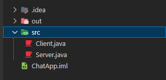

`Server.java`
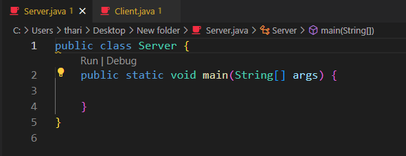

`Client.java`
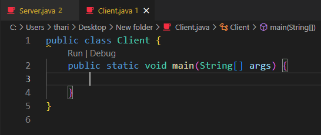

<pre>
</pre>
**. &nbsp;** **. &nbsp; .**

**1-Step:** **Server.java**

First, let's declare 5 objects.
  
  1. 1 . ServerSocket ServerSocket
  2. 2 . Socket clientSocket
  3. 3 . BufferReader in
  4. 4 . PrintWriter out

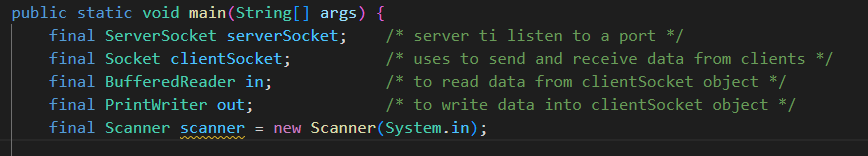

Now, let's instanciate the serverSocket object. The ServerSocket constructor requires the port number that the server will use to listen to clients' requests. The instanciation should be done inside a try catch block.

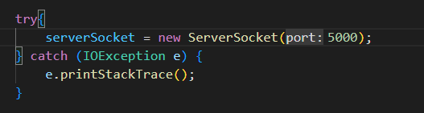

As the serverSocket is used by the server to listen to connection requests from clients, it uses the method `accept()` to wait for the request and once it received it and create an instance of `Socket` class which in our case will be the `clientSocket` object.

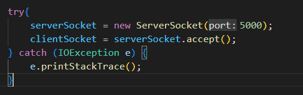

To instanciate `out`, we use the constructor of `PrintWriter` class, this constructor takes the output stream for the socket as a parameter, because it is responsible for sending data to client.

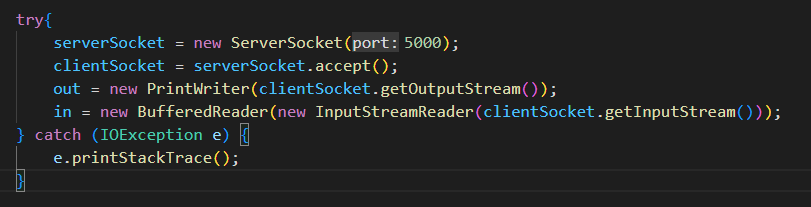

`Sender thread` : This thread contains the code the server will use to send messages to client.
`Receiver thread` : This thread contains the code the server will use to receive messages from client.

`Sender Thread`
 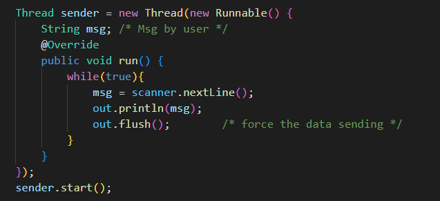

 `Receiver Thread`
 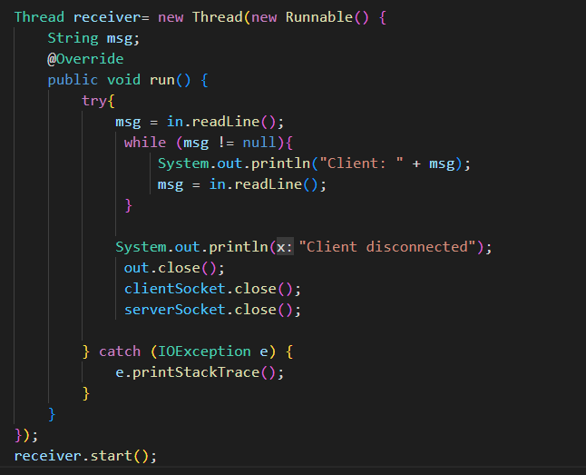

 Now the Server is ready to communicate with Client.

 You can get the full code for `Server.java` file **[here](../../../public/files/javaChatApp/Server.java)**

 <pre>
</pre>
**. &nbsp;** **. &nbsp; .**

**2-Step:** **Client.java**

You will see, the most of the codes are as same as the `Server.java`.
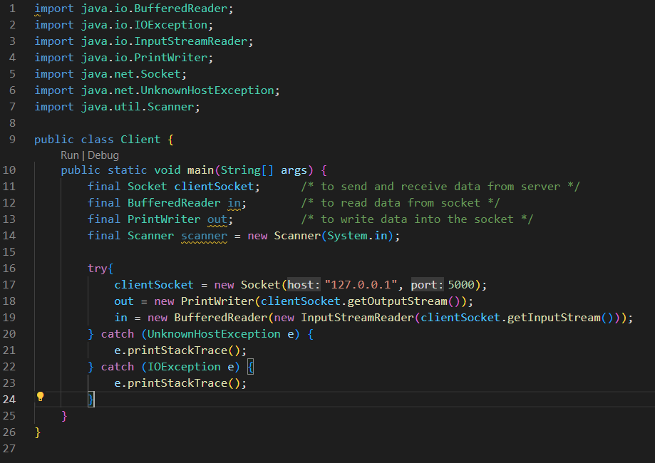

Now, the `Client.java` also has two threads, one for sending data and the other for recieving data, they are implemented the same way as the `Server.java`'s threads.

`Sender Thread`
 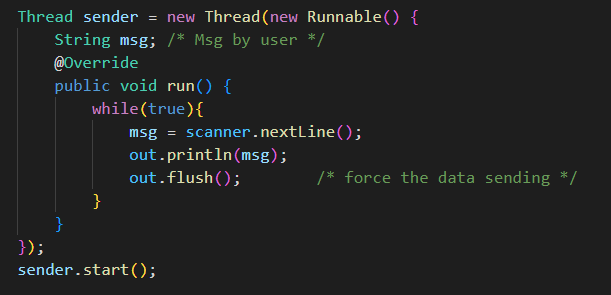

 `Receiver Thread`
 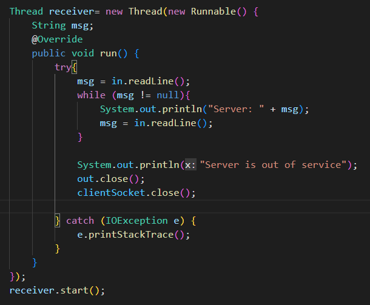

 Now the Client is also ready to communicate with Server.

 You can get the full code for `Client.java` file **[here](../../../public/files/javaChatApp/Client.java)**
 
**. &nbsp;** **. &nbsp; .**

**EXECUTION**

Nopw let’s see how this works.

First run the `Server.java` class then `Client.java` class.

**. &nbsp;** **. &nbsp; .**

**`Happy coding!`**

